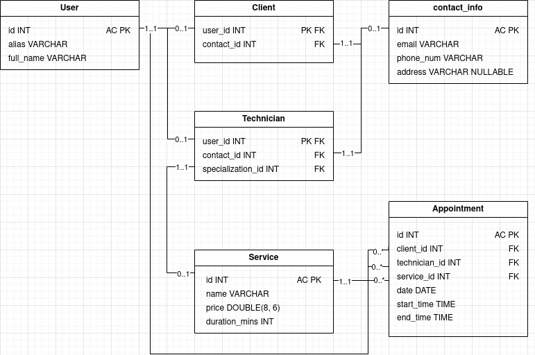

Base de dados
====================

Este módulo contem o código necessário para inicializar e utilizar a base de dados
em código.

.. centered:: Diagrama da base de dados:

|

A base de dados tem a estrutura suficiente para poder armazenar informação sobre uma
pequena empresa de limpeza e manutenção de piscinas. É capaz de guardar informações 
sobre os utilizadores do sistema (ex.: nome, diferentes informações de contacto), os
tipos de serviço que a empresa efetua e as marcações dos mesmos com os clientes e o
técnico responsável respetivo. 

Existem dois tipos de classes para o uso da base de dados:

* os *models*, que são os "dados";
* os *schemas*, que são as tabelas e as operações CRUD das mesmas.

Através dos diferentes schemas poderão ser usadas as queries mais comuns. As 
implementadas são as seguintes:

* ``.find_one(...)`` para pesquisar um resultado na correspondente tabela;
* ``.find_many(...)`` para pesquisar vários; 
* ``.create_one(...)`` para inserir dados;
* ``.delete(...)`` para apagar.

Os métodos CRUD de cada schema poderão ter *nuances* de como devem ser utilizados,
por favor consulte a documentação de cada um para não ocorrerem problemas inesperados.

Classes para o uso da BD
-------------------------

.. toctree::
   :maxdepth: 4

   app.database.models
   app.database.schema
